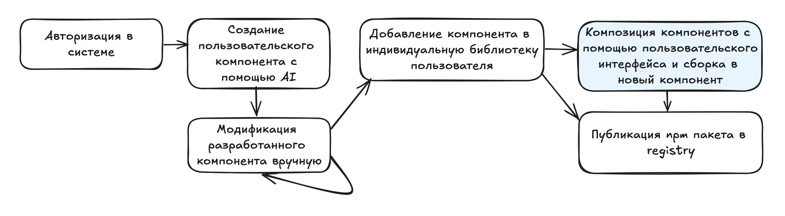
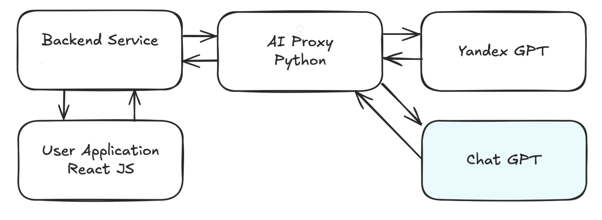

# Проектирование и разработка новой программной системы

### Краткое описание разрабатываемого приложения

Существует достаточно большое количество инструментов для создания веб-приложений без написания кода с помощью интерфейса. Идея разрабатываемого приложения для данного курса - создание приложения, которое использует генеративные модели искусственного интеллекта для реализации пользовательских интерфейсов.

Основной целью разрабатываемой системы является создание пользовательской библиотеки компонентов, возможность делиться компонентами и интегрировать компоненты между различными проектами. Данная библиотека является AI generated с дополнительными изменениями руками программиста (конечного пользователя). Дальнейшая работа с библиотекой реализуется посредством композиции разработанных компонентов при помощи кода (последовательный вызов разработанных компонентов из пользовательского кода) или композиции элементов внутри системы\*. Интеграция в проект пользователя - с использованием npm библиотеки.

### Основной use-case работы пользователя в приложении

### Базовая архитектура системы

### Дополнительные комментарии

- композиция элементов внутри системы - не уверен, насколько получится в семестре реализовать данную функциональность, поэтому это входит в изначальное планирование, но не могу гарантировать, что будет реализовано до конца, так как это подразумевает реализацию отдельного хостинга для пользовательских решений, что является довольно трудоемкой задачей
- те элементы на диаграмме, которые окрашены в синий - скорее дополнительные идеи и альтернативные сценарии. Очень маловероятно, что в семестре это будет реализовано
